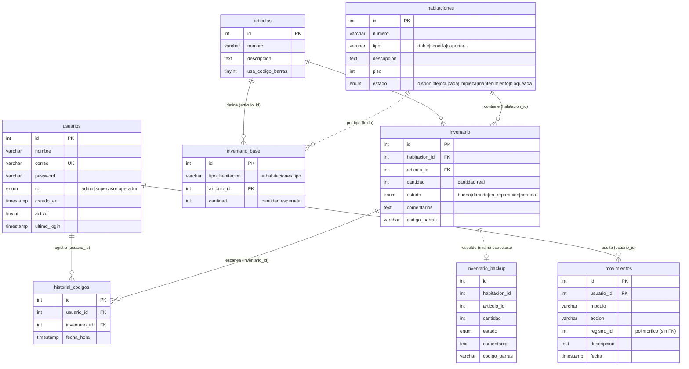
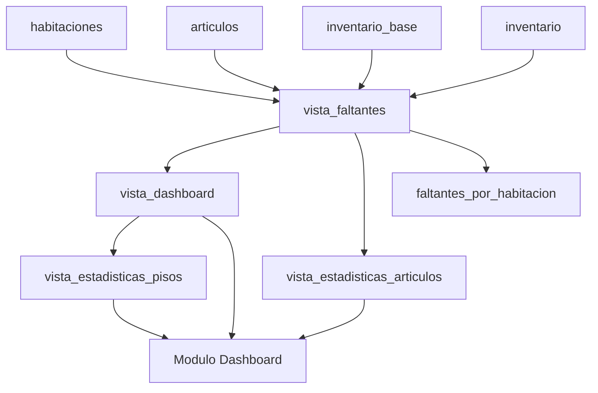
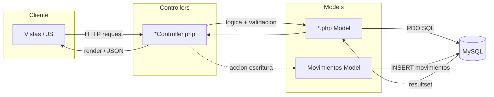
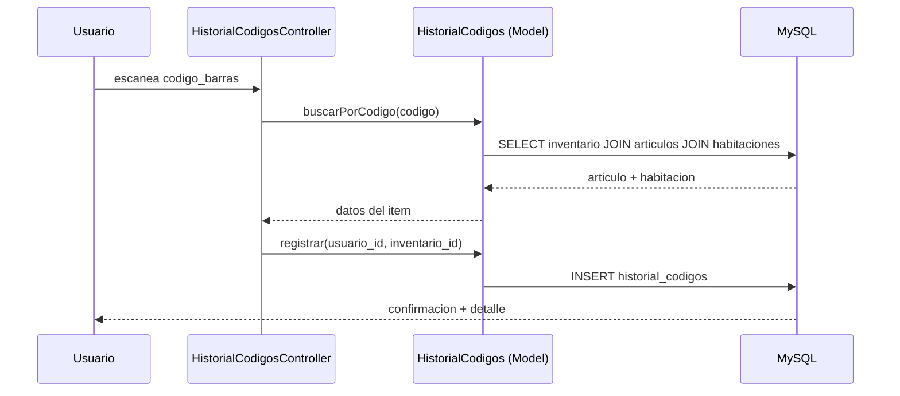
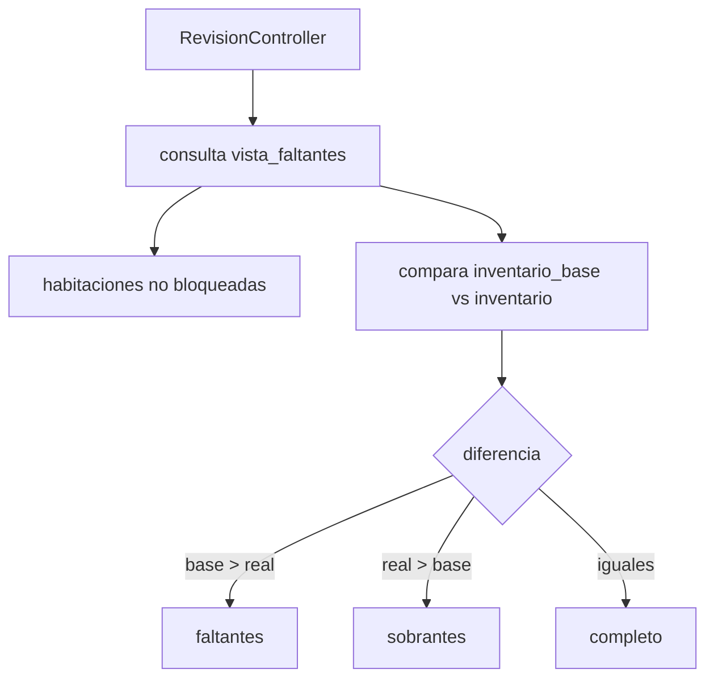
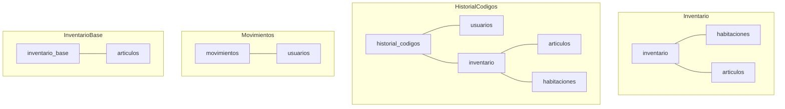

# Modelo y Flujo Relacional - Hotel Inventario

> Documento de referencia de la arquitectura de datos y el flujo relacional
> de toda la aplicacion. Incluye:
> 1. Diagrama Entidad-Relacion (ERD) completo
> 2. Capa de vistas analiticas (Dashboard)
> 3. Arquitectura MVC y flujo de peticiones
> 4. Flujo de datos por operacion (escaneo, revision, auditoria)
> 5. Mapa de JOINs reales por modulo
>
> Los diagramas usan sintaxis Mermaid (se renderizan en GitHub / VSCode con la
> extension "Markdown Preview Mermaid Support").

---

## 1. Diagrama Entidad-Relacion (ERD)

Estructura fisica de la base de datos. Las FK son logicas (usadas por la
aplicacion y los JOINs de las vistas); en el dump no estan declaradas como
constraints fisicos.

### Notas de diseno
- **Relacion por texto:** `habitaciones.tipo` <-> `inventario_base.tipo_habitacion`
  (linea punteada). Unico vinculo debil del modelo; recomendable normalizar a
  `tipo_habitacion_id`.
- **`movimientos.registro_id`** es una referencia **polimorfica**: apunta al ID
  de distintas tablas segun `modulo`, por eso no tiene FK real.
- **`inventario_backup`** replica exactamente la estructura de `inventario` como
  copia de respaldo (sin relaciones formales).
- La regla de negocio central: `faltante = base - real`, `sobrante = real - base`.

---

## 2. Capa de vistas analiticas (Dashboard)

Las vistas no son tablas; son consultas derivadas. Flujo de datos hacia el
modulo Dashboard.

| Vista | Deriva de | Calcula |
|---|---|---|
| `vista_faltantes` | 4 tablas base | faltantes/sobrantes por habitacion+articulo |
| `vista_dashboard` | vista_faltantes | totales y estado por habitacion |
| `vista_estadisticas_articulos` | vista_faltantes | faltantes agrupados por articulo |
| `vista_estadisticas_pisos` | vista_dashboard | conteos por piso |
| `faltantes_por_habitacion` | tablas base | vista auxiliar de faltantes |

---

## 3. Arquitectura MVC y flujo de peticiones

Toda peticion pasa por un patron Controller -> Model -> Database, y las acciones
de escritura registran auditoria en `movimientos`.

---

## 4. Flujo de datos por operacion

### 4.1 Escaneo de codigo de barras (Historial de codigos)

### 4.2 Revision de inventario (faltantes/sobrantes)

### 4.3 Auditoria (cualquier escritura)

---

## 5. Mapa de JOINs reales por modulo

Relaciones efectivamente ejecutadas en las consultas del codigo.

| Modulo | Tablas / Vistas | JOINs principales |
|---|---|---|
| Auth / Perfil | usuarios, movimientos | - |
| Usuarios | usuarios, movimientos | - |
| Habitaciones | habitaciones, movimientos | - |
| Articulos | articulos, movimientos | - |
| Inventario Base | inventario_base, articulos, movimientos | inventario_base.articulo_id = articulos.id |
| Inventario | inventario, habitaciones, articulos, movimientos | inventario -> habitaciones, inventario -> articulos |
| Revision | vista_faltantes, habitaciones | (via vista) |
| Historial Codigos | historial_codigos, usuarios, inventario, articulos, habitaciones | hc -> usuarios, hc -> inventario -> articulos + habitaciones |
| Movimientos | movimientos, usuarios | movimientos.usuario_id = usuarios.id |
| Dashboard | vista_dashboard, vista_estadisticas_articulos, vista_estadisticas_pisos | (via vistas sobre vista_faltantes) |
